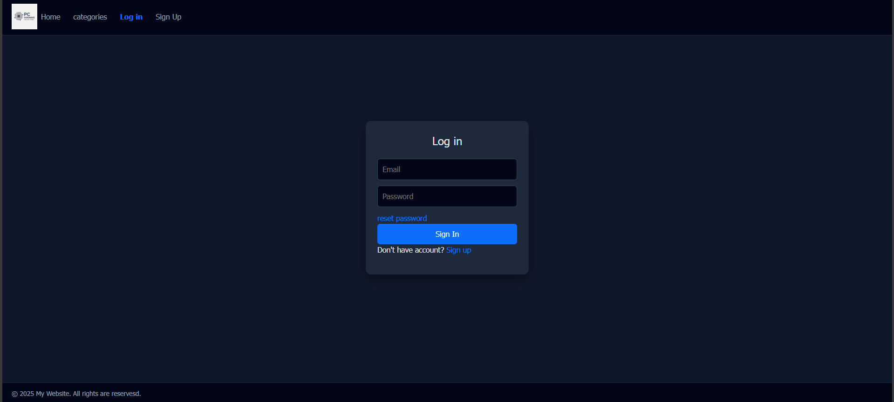
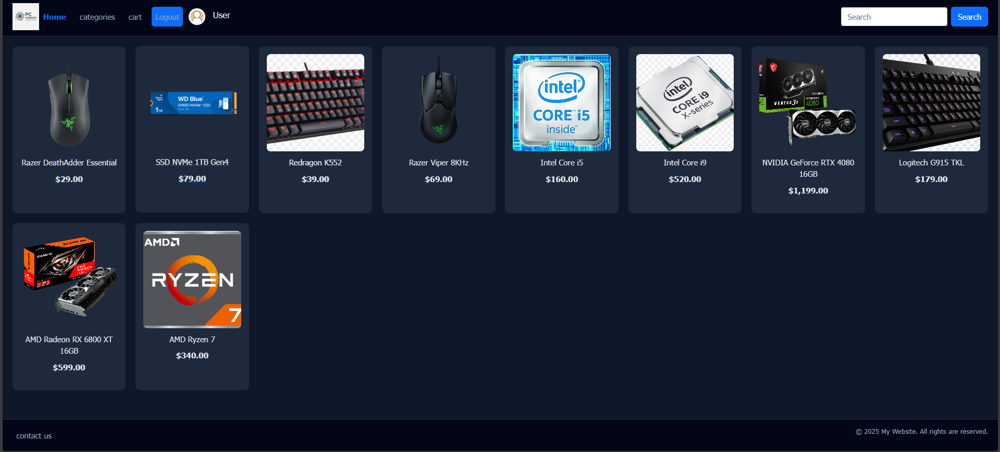
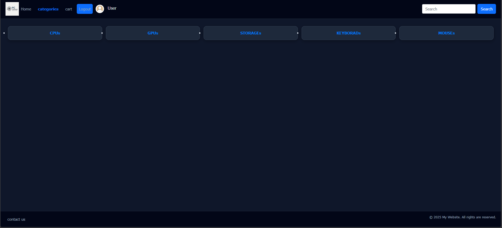
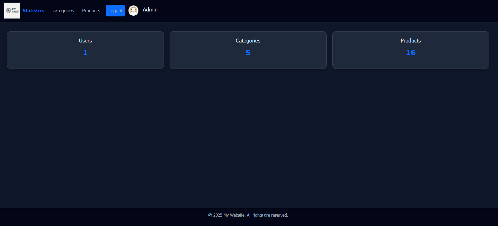

# 🛒 PHP E-Commerce Store System

A simple e-commerce web application built using PHP, MySQL, HTML, CSS, and Bootstrap.

---

## 📌 Project Structure

- `/index.php` → Login page (entry point of the system)
- `/accounts/` → Authentication (login, signup, logout)
- `/user/index.php` → User Home page after login
- `/admin/dashboard.php` → Admin dashboard
- `/includes/` → Reusable components (header, footer)
- `/database/` → Database connection
- `/css/` → Styling files
- `/photos/` → Images used in UI
- `/product photos/` → Product images

---

## 👤 User Features
- Login / Signup system
- Browse categories
- View products
- Add to cart
- Search functionality

---

## 🛠 Admin Features
- Dashboard statistics
- Manage categories (add/edit/delete)
- Manage products (add/edit/delete/activate)
- View users

---

## 🧰 Technologies Used
- PHP (Core)
- MySQL
- HTML5
- CSS3
- Bootstrap
- Font Awesome

---

## 📷 Screenshots

> Key pages of the system interface

---

### 🔐 Login Page
User authentication system with session-based login.

---

### 🏠 Home Page
Displays random products and main user landing page after login.

---

### 📂 Categories Page
Shows all product categories available in the system.

---

### 🛠 Admin Dashboard
Overview of system statistics (users, products, categories).

---

## 🎥 Demo Video

> Project demo video is available on Google Drive

🎥 [Watch Project Demo Video](https://drive.google.com/file/d/1VxYp3KOzAw29L09SjjDQhBzZUdXaxAVw/view?usp=sharing)

---

## 🗄️ Database

The project uses MySQL database.

### Setup Instructions:
1. Open phpMyAdmin or MySQL Workbench
2. Create a database (`store`)
3. Import the file located in: `database/store.sql`

---

## 🚀 How to Run

1. Install XAMPP
2. Move project to `htdocs`
3. Import database
4. Run: http://localhost/php-store-project/user/index.php

---

## ⚠️ Notes
This project uses dummy data and is intended for learning purposes only.
It runs locally using XAMPP or WAMP.

---

## 👨‍💻 Author
Hamza Al-alwani